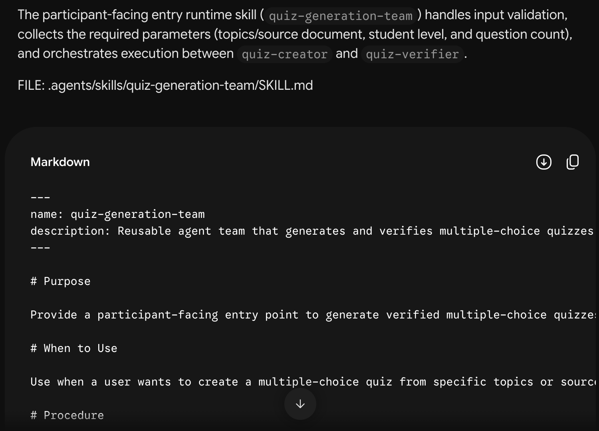

# Step 01 — Build your quiz team

Use **Gemini Flash**. Finish [Gemini setup](../00-gemini-setup/README.md) first. You are creating the team's instructions here; you will supply quiz topics or documents when running it in Antigravity.

## 1. Select the Builder

Start a new Gemini chat. Select **Flash**, type `/`, and choose **design-reusable-agent-team** from the menu. Check that it is selected before sending your first message.


Select it once at the start. Keep the same chat for the remaining prompts.

## 2. Describe the team you want

Send:

```text
I want a reusable team that generates multiple-choice quizzes for students from topics I provide or documents I attach. It should check the questions and answer key before delivering the quiz. Help me design the workflow first.
```


Gemini should explain who writes the quiz, who checks it and how the team works. Ask for changes if the plan does not match your goal.


## 3. Ask Gemini to build it

When the plan looks right, send:

```text
Build that team now. Each quiz should collect the topics or source document, intended student level, and question count. Its output should include the questions, answer choices, correct answers, and brief explanations.
```


Gemini explains each file and gives it to you one at a time.

## 4. Download each file

Use the workshop's **my-team** folder, beside the numbered lessons. Create missing folders as needed. Every path after Gemini's `FILE:` label starts inside `my-team/`.

| Save the download here | What it does |
| --- | --- |
| `my-team/.agents/skills/quiz-generator/SKILL.md` | Explains how to write suitable questions and answers. |
| `my-team/.agents/agents/quiz-creator.md` | Writes the quiz. |
| `my-team/.agents/agents/quiz-verifier.md` | Independently checks the questions and answers. |
| `my-team/.agents/skills/quiz-generation-team/SKILL.md` | Asks for missing information and runs the team. |

For each file:

1. Click **Download**, the circled downward arrow beside the copy icon.
2. Move the download to its exact location in the table. Rename it if needed; use `SKILL.md`, not `SKILL (1).md`.
3. Open it in a text editor and check that the whole file is present, including the information at the top. If it is incomplete, ask Gemini for the complete file.
4. After saving, send this in the same chat if another file is pending:

```text
Continue
```



The screenshot shows only part of the file. **Download** gets the file; do not select just the visible text. If your team uses different names, follow its exact `FILE:` locations.

## 5. Check that the team is complete

Stop sending `Continue` when:

- All four complete files are saved.
- Every listed component says **CURRENT**.
- Gemini says **Next Pending Component: None**.


One file saying CURRENT does not mean the whole team is finished. You will check whether the saved team works in Antigravity.

## Add the interactive page

Open [Add an interactive quiz page](../03-debug-and-improve/README.md) and stay in this Gemini chat. After saving the updated files, [try the team in Antigravity](../02-antigravity-setup/README.md) with **Gemini 3.6 Flash**.
