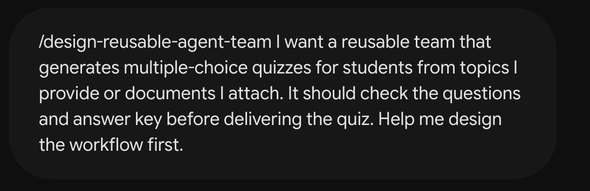

# Example — Plan the quiz workflow

Use this optional example in the same **Gemini Flash** Builder chat as Step 01. It helps you review the plan before asking for files. No source document is needed yet.

## Describe what you want

```text
Design a reusable team that generates quizzes from topics or reference files.
It should collect missing topics or source material and question count, use an
independent reviewer, and leave the use decision to a human.
```



## Check the plan

The team should:

1. Ask for topics or a readable document, student level and question count.
2. Have `quiz-creator` write the questions, choices, answers and explanations.
3. Have `quiz-verifier` independently check the complete quiz against your request and any source document.
4. Correct problems and check the updated quiz again, with a clear limit on repeated attempts.
5. Give you the checked quiz so you can decide whether to use it.

If you add HTML later, `quiz-html-builder` should create the page only after the quiz passes review.


Ask for changes if the plan misses a job or asks for unnecessary information. Agree on difficulty and format defaults before building.

## Build the files

Use [the build example](../build/README.md) once the plan looks right. The screenshots show the example conversation; your own files still need to be downloaded, saved and tested.
