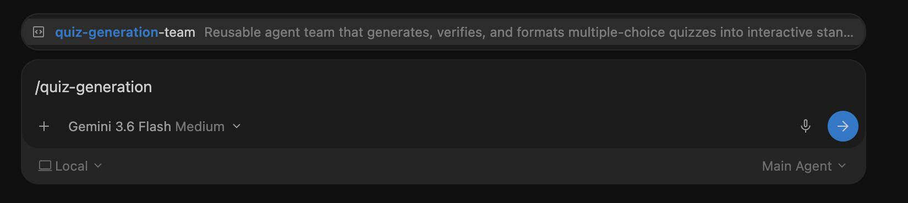
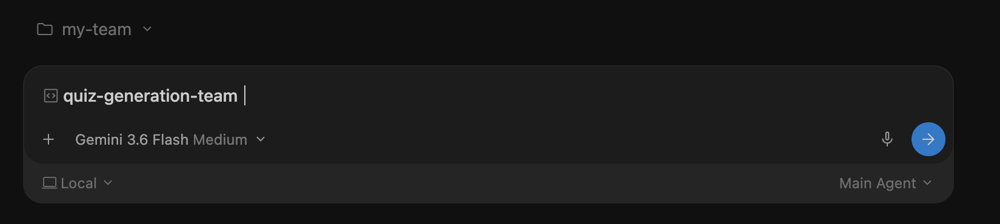
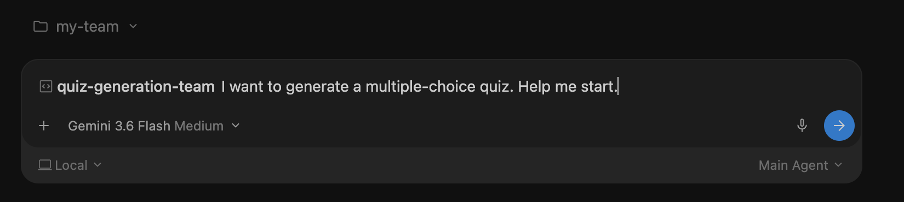
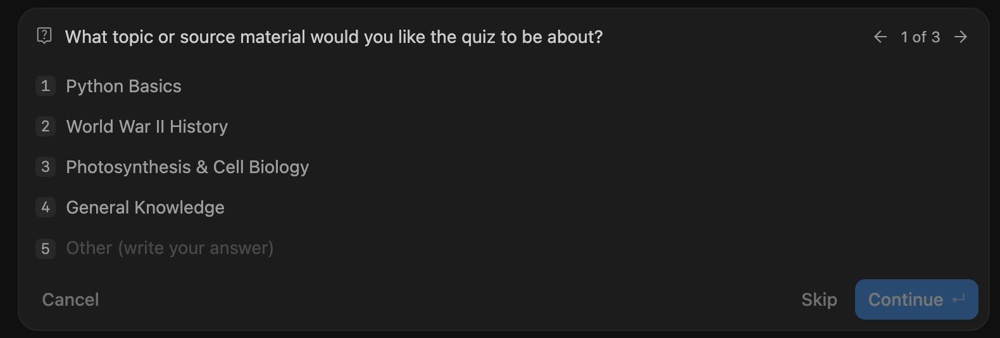
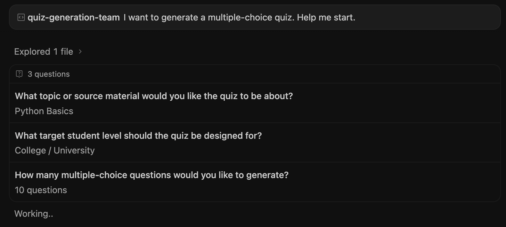

# Step 02 — Try your quiz team in Antigravity

Create a project, run your team and check the interactive quiz page. Use **Gemini 3.6 Flash**. If the model or credits run out, stop; do not switch to Flash Lite.

Have the five files from [building the team](../01-gemini-skill/README.md) and [adding HTML](../03-debug-and-improve/README.md) saved first. The project-creation screenshots are ready; the quiz run is being checked next.

## 1. Prepare your folder

Use the workshop's **my-team** folder. If it does not exist, create it beside the numbered lessons. Keep the files you already downloaded in Steps 01 and 03.

Your folder should contain:

```text
my-team/
├── .agents/
│   ├── agents/
│   │   ├── quiz-creator.md
│   │   ├── quiz-verifier.md
│   │   └── quiz-html-builder.md
│   └── skills/
│       ├── quiz-generator/SKILL.md
│       └── quiz-generation-team/SKILL.md
├── sources/
└── outputs/
```

The creator writes, the verifier checks, and the HTML builder makes the page. `quiz-generator` explains the writing method; `quiz-generation-team` runs the team. Use the updated team file from Step 03.

Create `outputs/` if missing. Keep old instruction backups outside `.agents`. On macOS, **Command + Shift + .** reveals hidden folders. See [the save reference](SAVE-REFERENCE.md) for exact locations.

> **Screenshot 1 — Project folder:** Show my-team and the five instruction files. Save as `02-project-folder.png`.

<!-- IMAGE SLOT: ../assets/antigravity/02-project-folder.png -->

## 2. Create the Antigravity project

1. Click the **folder with a +** beside **Projects**, then choose **New Project**.


2. Open your existing **my-team** folder and click **Open**. Choose the folder containing `.agents`, not `.agents` itself or the workshop parent. Hidden folders may not appear in this window.


3. Check **my-team** appears above the message box. Use **Local** and **Gemini 3.6 Flash**.


Your existing folder becomes the project. You do not need an app template or Git setup.

## 3. Choose the model and Skill

Start a fresh chat in the project. Select **Gemini 3.6 Flash**. Type `/` in the message box, find **quiz-generation-team**, and select it from the menu before sending a message.

This is the Skill that runs your quiz team. The Gemini Builder was used to create its instructions.

If the Skill is missing, check the folder and file locations, then start a fresh chat. Typing its name does not select it. The official [Skill guide](https://www.antigravity.google/docs/skills?tab=ide) explains where Skill files belong.



Select the result. Its name appears in the message box with a Skill icon. Keep it there and add your first request after it.



## 4. Let the team ask what it needs

Send:

```text
I want to generate a multiple-choice quiz. Help me start.
```



The team asks for the topic, student level and number of questions. Answer each question before it begins.

## 5. Answer the three questions

For this walkthrough, choose:

1. **Python Basics** as the topic, then click **Continue**.



2. **College / University** as the student level, then click **Continue**.


3. **10 questions**, then click **Submit**. This starts the team.


You can choose **Other** to write your own answer. For a document-based quiz, attach the document or put it in `my-team/sources/` and give its path. The team must be able to read it before using it.



## 6. Watch the team work

Keep the same chat after submitting your answers. You do not need to reselect the Skill each turn.

The expected order is **write → independently check → correct if needed → check again → create the HTML page**. HTML should be created only after the quiz passes review.

Look at the actual worker activity or its history. A response naming the workers alone does not prove they ran. If a worker cannot run or the reviewer cannot read the required material, stop that step and keep the error for [repair](../03-debug-and-improve/repair-prompts.md).

Open the activity panel to see the workers. In this run, **Quiz Draft Creator**, **Quiz Auditor & Verifier** and **HTML Web App Builder** all completed. Open their details to read the review and check the order.


## 7. Check the saved files

Open `my-team/outputs/` and the files named in the team's response. Use the actual filenames it reports.

Check for ten Python Basics questions at College / University level, four choices each, one correct answer and brief explanations. Read the review and any corrections. Confirm both the quiz and HTML page are saved.

> **Screenshot 7 — Saved result:** Show the output files and the final response or review result. Save as `02-saved-result.png`.

<!-- IMAGE SLOT: ../assets/antigravity/02-saved-result.png -->

## 8. Try the quiz page

The response links to **python_basics_quiz.html**. Open the saved file in a browser. Answer the questions and use its submit/check button.


- Check correct and incorrect answers show the right feedback.
- Compare the score with the reviewed answer key.
- Check explanations appear after answering or submitting.
- Try reset/retry if available.
- Check the page works as a standalone file, without a separate server.

Report any mismatch with the question, your choice and the displayed result. Recheck the correction before using the quiz.


This capture shows **5/10 (50%)**, correct-answer feedback and a **Retake Quiz** button. Check incorrect-answer explanations and the retake behavior too.

## Decide whether to use it

Read the final quiz, check the review and try the page before using or sharing it. If the reusable instructions need a change, use [the Gemini repair prompts](../03-debug-and-improve/repair-prompts.md), save the replacements, then test again in a fresh Antigravity chat.

During our guided test, we will stop at each screenshot space and wait for your capture and **continue**. Work may finish between pauses; use activity history where needed. See [the screenshot list](../assets/antigravity/README.md).
