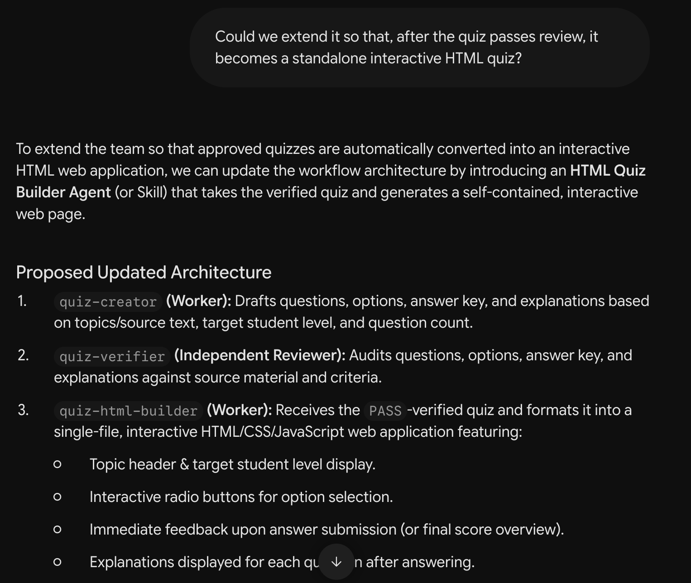
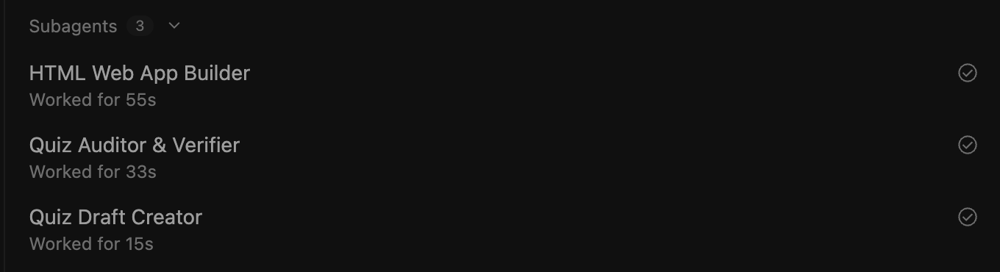
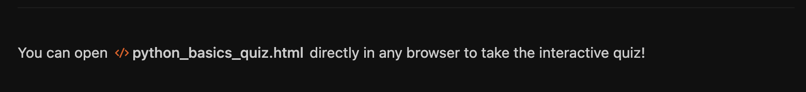
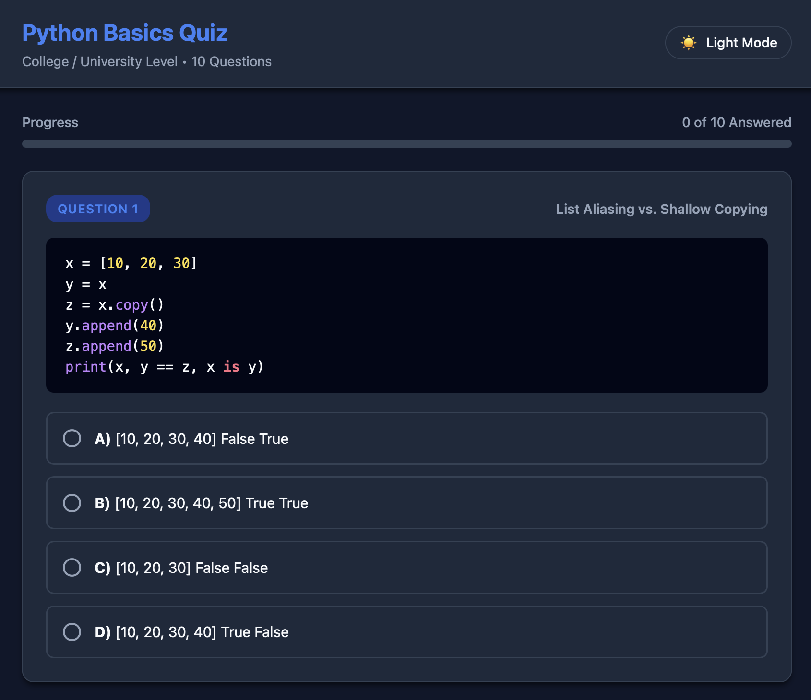
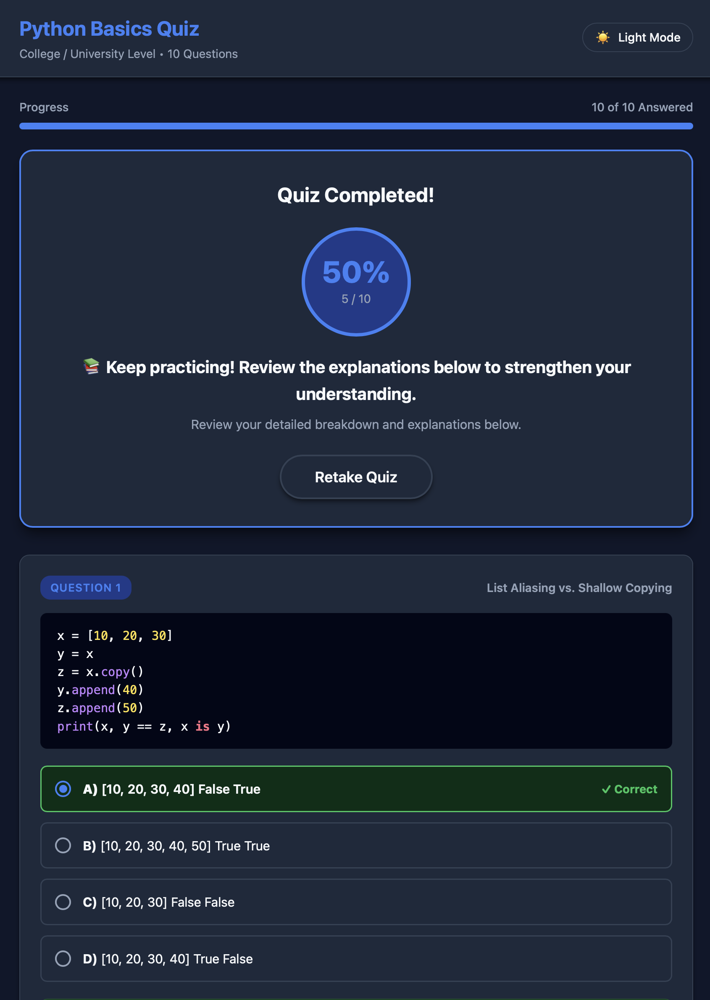

# Step 03 — Add an interactive quiz page

After [testing the four-file team in Step 02](../02-antigravity-setup/README.md), extend it to turn the reviewed quiz into a page where students can select answers and see their score and explanations. This step adds `quiz-html-builder.md` and replaces the team's `SKILL.md`, bringing the team to five files.

## 1. Ask Gemini for the change

Return to the **same Gemini chat** used in Step 01. Keep **Flash** selected and send:

```text
Could we extend it so that, after the quiz passes review, it becomes a standalone interactive HTML quiz?
```

Check that Gemini proposes creating the page **after** the quiz has been checked.



## 2. Apply and download the new file

When the proposal looks right, send:

```text
apply
```

Gemini generates `quiz-html-builder.md`. This file tells the team how to turn a checked quiz into an interactive page.

Click **Download** beside the copy icon on the Markdown block. Move the downloaded file to:

```text
my-team/.agents/agents/quiz-html-builder.md
```

Rename it to `quiz-html-builder.md` if needed.


## 3. Download the updated team instructions

In the same Gemini chat, send:

```text
Continue
```

Gemini generates an updated `SKILL.md`. This tells the team to create the interactive page after the quiz passes review.

Keep a backup of the old file outside the `.agents` folder. Download the new file and replace:

```text
my-team/.agents/skills/quiz-generation-team/SKILL.md
```

Name it exactly `SKILL.md`. Keep the existing quiz method, creator and verifier files unchanged.

## 4. Check that Gemini is finished

Download and save each file before requesting the next one. Send `Continue` only while something remains pending.

You are finished when:

- All five team files are saved, including the new HTML builder and updated team instructions.
- Every listed component says **CURRENT**.
- Gemini says **Next Pending Component: None**.


If a file is missing or incomplete, ask Gemini for the complete file before moving on. These screenshots show the example conversation; your own files still need to be downloaded and saved.

## 5. Run the extended team in Antigravity

Return to the **my-team** project you created in Step 02. Use **Local** and **Gemini 3.6 Flash**. Start a fresh chat so it uses the updated instructions, select `quiz-generation-team` from the Skill menu, and try the same quiz request again. Follow [Step 02's input steps](../02-antigravity-setup/README.md#4-let-the-team-ask-what-it-needs) if needed.

Your folder should now contain:

```text
my-team/
├── .agents/
│   ├── agents/
│   │   ├── quiz-creator.md
│   │   ├── quiz-verifier.md
│   │   └── quiz-html-builder.md
│   └── skills/
│       ├── quiz-generator/SKILL.md
│       └── quiz-generation-team/SKILL.md
├── sources/
└── outputs/
```

The expected order is **write → independently check → correct if needed → check again → create the HTML page**. HTML should be created only after the quiz passes review. Open the worker activity and details to confirm the creator, verifier and HTML builder ran in that order; worker names in a response alone do not prove execution.



Open `my-team/outputs/` and confirm both the reviewed quiz and HTML page are saved. Use the actual filenames reported by the team. In the example, the response links to **python_basics_quiz.html**.



## 6. Try the quiz page

Open the saved HTML file in a browser. Answer the questions and use its submit/check button.



- Check correct and incorrect answers show the right feedback.
- Compare the score with the reviewed answer key.
- Check explanations appear after answering or submitting.
- Try reset/retry if available.
- Check the page works as a standalone file, without a separate server.

Report any mismatch with the question, your choice and the displayed result. Recheck the correction before using or sharing the quiz.



This capture shows **5/10 (50%)**, correct-answer feedback and a **Retake Quiz** button. Check incorrect-answer explanations and the retake behavior too. The Antigravity image filenames keep their original `02-` prefix; these HTML results belong to the extended team in Step 03.

For other changes, [these optional prompts](repair-prompts.md) explain what to send in Gemini and what to ask directly in Antigravity.
